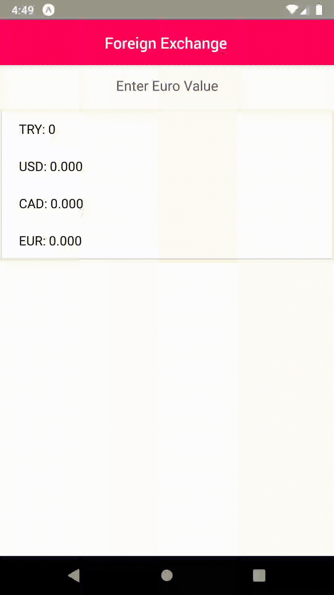

# React-Native-Exchange-App
installation: 
Please get your own api key from : https://fixer.io/
in constants.js you can see how to use api key. 

```
npm i --save 
expo start
```



This is simple foreign exchange application. You can see basic api usage with axios library in react-native. 
For UI I used native-base components. For more lovely native-base components please see : https://docs.nativebase.io/
In the project I  indicate how to develop for more interesting result. This is only created to show how to make get request and interpret data in project.
